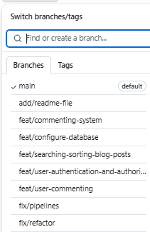

# Blog Application

## Project Overview
This project involves the development of an Express-based blog application, focusing on posting and reading blog entries. The primary objective was to apply Software Quality Assurance (SQA) principles to enhance and refine the application, ensuring it is robust, secure, and thoroughly tested. This was achieved by expanding its features, reinforcing security measures, and implementing comprehensive testing protocols.

## Team Contributions

- **Mohammad**: Responsible for implementing sort and search features, as well as setting up the CI/CD pipeline - 30%.
- **Baaizeed**: Developed the commenting functionality and contributed to writing this README and setup instructions - 30%.
- **Saleha**:  Focused on user authentication features, including testing and contributions to pipeline setup - 40%.

### Prerequisites

1. **Required Software**:
   - Install [Node.js](https://nodejs.org/) (version 14 or higher recommended).
   - Install [SQLite3](https://www.sqlite.org/).
   
2. **Clone the Repository**:
   ```bash
   git clone https://github.com/your-repo/blog-application.git
   cd blog-application
   ```

### Steps to Run

1. **Install Dependencies**:
   Install the required Node.js packages:
   ```bash
   npm install
   ```

2. **Environment Setup**:
   Create a `.env` file in the root directory with the following variables:
   ```env
   PORT=3000
   SESSION_SECRET=your_secret_key
   ```

3. **Initialise the Database**:
   - Run the application to initialise the SQLite database:
     ```bash
     npm start
     ```

4. **Start the Application**:
   Launch the server with:
   ```bash
   npm start
   ```
   The application will run at `http://localhost:3000` by default.

5. **Run Tests**:
   To execute the test suite:
   ```bash
   npx test
   ```
   Check the generated test coverage report to ensure thorough testing.

### Troubleshooting

- **Common Issues**:
  - Database not initialising: Ensure write permissions in the project directory.
  - Missing dependencies: Re-run `npm install`.

- **Logs**:
  - Check the terminal output for server logs and error messages.
For any additional assistance contact the development team.

## Implemented Features

### Core Features

1. **User Authentication**:
   - Login and Registration functionality.
   - Security measures including password hashing, session-based authentication, and user role management.
   - [Watch Video](src/videos/LoginRegister%20Feature.mp4)

2. **Blog Post Management**:
   - Capability to create, edit, and delete blog posts.
   - Advanced search and sorting options for blog posts based on date, title, or keywords.
   - [Watch Video](src/videos/Create%20Post.mp4)
   - [Watch Video](src/videos/Search%20Feature.mp4)

3. **Commenting System**:
   - Users can add and reply to comments on individual blog posts.
   - Supports nested comment threads.
   - [Watch Video](src/videos/Comment%20Feature.mp4)

### Advanced Features

- **Security Enhancements**:
  - Password Hashing: Implemented using bcrypt for secure storage.
  - Input Sanitisation: Measures to prevent XSS and SQL injection attacks.
  - CSRF Protection: Added via middleware integration.

- **Error Handling**:
  - User-friendly error messages and dedicated error pages.

## Challenges and Solutions

1. **Nested Comments**:
   - **Challenge**: Managing parent-child relationships.
   - **Solution**: Implemented a flexible database schema and recursive rendering logic in Pug templates.

2. **Password Security**:
   - **Challenge**: Ensuring robust password protection.
   - **Solution**: Validated password strength with regex and used bcrypt for secure hashing.

3. **Testing and Coverage**:
   - **Challenge**: Achieving comprehensive test coverage.
   - **Solution**: Developed unit and integration tests covering happy paths and edge cases.

4. **Branch Management and Conflicts**:
   - **Challenge**: Conflicts arose when updating branches with the main branch.
   - **Solution**: Improved communication on push schedules and frequently committed and pulled updates to minimize conflicts. Received guidance from Josh which streamlined the conflict resolution process.

5. **Pipeline Errors**:
   - **Challenge**: Repeated errors in the CI/CD pipeline.
   - **Solution**: Researched the error online, with a Stack Overflow solution providing the fix needed to stabilize the pipeline.

## Evidence for Marking Criteria

### Feature Implementation

Thorough implementation of user authentication and blog management features, with robust CRUD operations and additional sorting and searching functionalities.

1. **User Authentication**:
   - **Code**: [`userController.js`](./userController.js), [`ensureAuth.js`](./ensureAuth.js).
   - **Templates**: [`register.pug`](./register.pug), [`login.pug`](./login.pug).

2. **Blog Management**:
   - **Code**: [`blogController.js`](./blogController.js), [`index.js`](./index.js).
   - **Templates**: [`create.pug`](./create.pug), [`edit.pug`](./edit.pug), [`post.pug`](./post.pug).

3. **Comments**:
   - **Code**: [`commentController.js`](./commentController.js), [`comment.js`](./comment.js).
   - **Templates**: [`post.pug`](./post.pug).

   ### Usability

1. **User Interface**:
   - **Templates**: [`index.pug`](./index.pug), [`layout.pug`](./layout.pug), [`500.pug`](./500.pug).
   - **Details**: Clean, responsive, and intuitive design.

2. **Search and Sort**:
   - **Code**: [`blogController.js`](./blogController.js).
   - **Templates**: [`index.pug`](./index.pug).
   - **Details**: Filters and sorts posts dynamically.

### Technical Robustness

1. **Secure Password Handling**:
   - **Code**: [`userController.js`](./userController.js), [`ensureAuth.js`](./ensureAuth.js).
   - **Details**: Passwords are hashed and stored securely.

2. **Error Handling**:
   - **Code**: [`blogController.js`](./blogController.js), [`500.pug`](./500.pug).
   - **Details**: User-friendly error messages and robust logging.

### Advanced Features

1. **Statistics**:
   - **Code**: [`blogController.js`](./blogController.js), [`stats.pug`](./stats.pug).
   - **Details**: Provides insights into post statistics.

2. **Nested Comments**:
   - **Code**: [`commentController.js`](./commentController.js), [`comment.js`](./comment.js).
   - **Templates**: [`post.pug`](./post.pug).
   - **Details**: Supports hierarchical comments.

### Testing

Comprehensive unit and integration tests developed, employing Jest to ensure high code coverage and reliability.

1. **Test Coverage**:
   - Achieved over 85% test coverage.
   - **Tools**: Jest and Supertest for unit and integration tests.

2. **Example Tests**:
   - Unit tests for user authentication logic.
   - Integration tests for end-to-end workflows (e.g., posting a comment).

3. **Evidence**:
   - Test-Driven Development (TDD) Approach:
   In developing our blog application, we employed a Test-Driven Development (TDD) strategy to ensure a robust and reliable codebase. Our approach involved the following steps:
      1. Defining Test Cases Before Development:
        - Prior to writing any functional code, we outlined specific test cases to validate the expected behavior of our features. This included scenarios for both successful operations and edge cases.

      2. Unit and Integration Tests:
        - We created unit tests for our core components, focusing on models and utility functions.
        - Integration tests were designed to simulate end-to-end workflows, covering user interactions such as login, registration, blog creation, and commenting.

      3. Continuous Testing:
        - Tests were run continuously during the development phase, with code only being written to pass pre-defined tests, ensuring that each feature met its requirements before moving forward.

      4. Test Coverage Reports:
        - Utilising Jest, we generated test coverage reports to ensure comprehensive coverage across our application.

      Example Tests:
     
     
     
     The provided screenshot displays test failures, which emphasizes writing tests before writing the implementation code. The first failure concerns a GET request expected to redirect based on session, but it results in a 500 error, suggesting an issue with session handling or  routing logic. The second failure occurs because a middleware function expected to be invoked isn't called, indicating potential errors in middleware registration within the request pipeline. The third test highlights a mismatch in expected and received responses from an error handler meant to catch exceptions and return a 500 status code, pointing to possible flaws in error-handling setup. To resolve these, developers should carefully review and adjust the session logic, middleware setup, and error-handling code, using TDD's "Red-Green-Refactor" cycle to iteratively test and refine the application.

   
   
   The updated screenshot showing passing tests indicates successful problem resolution using Test-Driven Development (TDD). Initially, tests failed due to issues with session-based redirection, middleware invocation, and error handling. By systematically applying TDD's iterative cycle of failing tests ("Red"), implementing minimal code changes to pass those tests ("Green"), and refining the functional codebase for efficiency and clarity ("Refactor"), we have addressed these challenges. Now, the GET request correctly handles session logic and redirects as expected, middleware functions execute in the correct order, and the error-handling middleware effectively catches exceptions, returning appropriate responses. This demonstrates a robust application design, aligned with the thorough correctness ensured by TDD practices.

   
   
   The initial integration test failures for the Comment model highlight two main issues: a ReferenceError when trying to create a Comment instance with default values, and an unexpected error type during validation checks. The ReferenceError indicates that the Comment model was likely not correctly imported or configured within the test environment. Additionally, the test expected a SequelizeValidationError when required fields are null, but it encountered a ReferenceError instead, suggesting that the error-handling or model validation configuration may have been incomplete or misdirected.

   
   
   By addressing these issues—ensuring the Comment model is properly defined and handling field validations correctly—it resulted with expected behaviors, ensuring tests pass and the model functions as intended. Implementing these corrections using TDD principles ensures a reliable and well-tested integration process.

   - Example Test files: [`tests/app.test.js`](./tests/app.test.js), [`tests/models/blog.test.js`](./tests/models/blog.test.js).

### Security Enhancements

Consistently applied security measures across the application, including bcrypt for passwords, CSRF protection, and input sanitisation.

1. **Password Hashing**:
   - Used bcrypt to securely hash passwords.
   - **Code**: [`userController.js`](./userController.js).

2. **Input Validation**:
   - Validated and sanitised user inputs.
   - **Code**: [`commentController.js`](./commentController.js).

3. **CSRF Protection**:
   - Implemented using middleware.

### Code Quality and Refactoring

The codebase has been refactored for modularity and maintainability, adhering to coding standards with meaningful documentation throughout the project.

1. **Modularisation**:
   - Refactored controllers and models for better separation of concerns.
   - **Code**: [`blogController.js`](./blogController.js), [`commentController.js`](./commentController.js).

2. **Documentation**:
   - Added meaningful inline comments and consistent formatting.

### CI/CD and Git Practices

Effective use of GitHub for collaborative version control. GitHub Actions have been configured to automate testing and code quality checks, with a structured branching strategy and regular, meaningful commits.

1. **GitHub Actions**:
   - Configured CI/CD for automated testing and linting.
   - **Files**: [`.github/workflows/main.yml`](./.github/workflows/main.yml).

2. **Git Practices**:
   - Used feature branches for development.
   - Regular commits with descriptive messages.

   

   In our project, we adhered to effective collaboration practices through the use of pull requests (PRs) and diligent commenting. Each PR was initiated to propose significant changes or feature additions, ensuring that the code alterations were visible and could be independently reviewed. We actively engaged in discussions within the PRs, enabling team members to provide constructive feedback and suggestions, enhancing the quality of our codebase. Reviewers promptly pointed out concerns, such as redundant blog posts, which were then swiftly addressed by the author demonstrating our commitment to maintaining a clean and functional application. Additionally, reviews were requested from peers, facilitating collective code ownership and knowledge sharing. This rigorous review process not only contributed to high code quality but also allowed us to merge changes confidently, following proper procedures and workflows.

   

   In our project, we utilized a systematic approach to branching that included feature, test, and fix branches, ensuring a streamlined and organized development process. Feature branches were dedicated to developing new functionalities like authentication and commenting, allowing these developments to proceed smoothly without impacting the stable main branch. Test branches were used to rigorously validate each aspect of the application with unit and integration tests, isolating testing processes to ensure accuracy and thoroughness. Fix branches allowed us to address any identified issues promptly, focusing on resolving bugs and refining features before merging them into the main codebase. This structured branching strategy facilitated effective collaboration, reduced conflicts, and maintained the integrity and quality of the project's code throughout the development lifecycle.

**Problems Initialising Pipeline**:


The CI/CD pipeline failure depicted in the screenshot stems from an issue encountered during the "Install dependencies" step, where the process attempts to run npm ci. The error message "Cannot read property 'bcryptjs' of undefined" suggests a problem either with the package dependencies defined in the package.json or a mismatch with the npm environment configuration. This could be due to an incorrect or missing dependency version specification, or other issues within the dependency chain.


The pipeline failure due to the inability to read the 'bcryptjs' property was effectively resolved by updating the Node.js version used in the CI/CD environment. Initially, efforts were concentrated on updating the bcryptjs package itself, suspecting version compatibility issues with its dependencies. However, after several attempts and still encountering installation errors, the decision was made to explore alternative solutions. Through a process of trial and error, it became apparent that the root issue was compatibility between the existing Node.js version and the bcryptjs package. Updating Node.js to a newer version aligned better with the package's requirements, leading to a successful resolution of the dependency installation issue.

Thank you for evaluating our project. Let us know if you have any questions or feedback!
